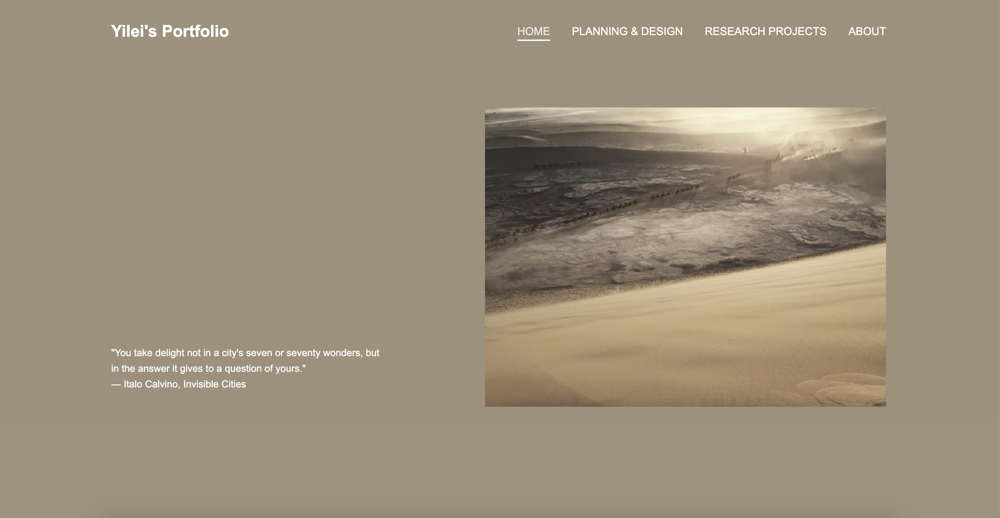
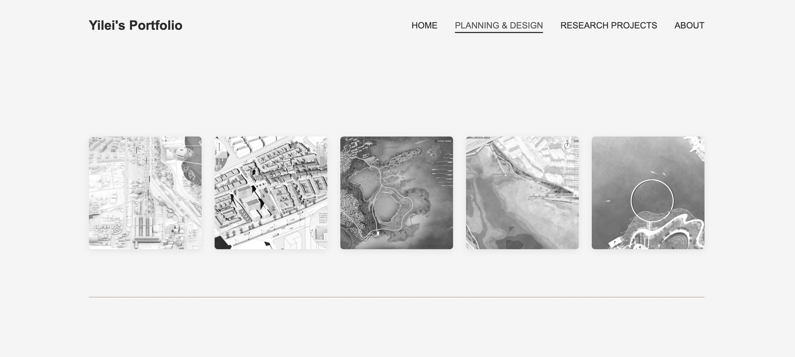
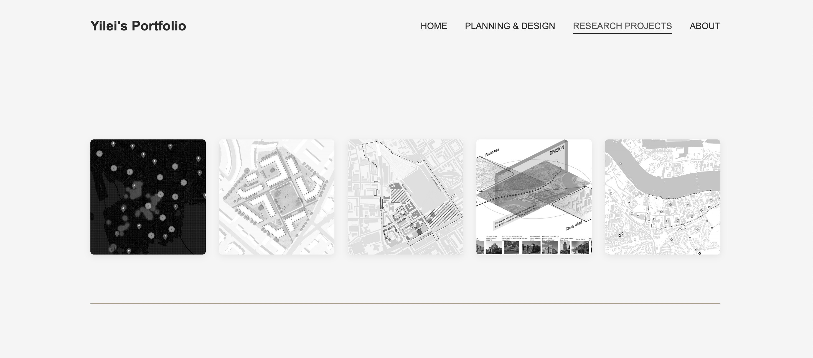

# Portfolio Website
This is my personal portfolio website featuring past research projects in urban studies, urban/landscape planning work. 
Screenshots of webpages: 
 
 
 

## 🚀 Live Demo
Visit the live website: [Click me!](https://yileics.github.io/portfolio/)

## 🛠️ Built With
- **HTML5**: Semantic markup structure
- **CSS3**: Modern styling with flexbox, grid, and custom properties
- **Vanilla JavaScript**: Interactive functionality without external dependencies
- **GitHub Pages**: Free hosting and automatic deployment

## 🎨 Sections
- **Home**: Hero section with introductory quote
- **Planning & Design**: Urban planning and architectural projects
- **Research Projects**: Academic research and analysis work
- **Research Projects**: HCI and Webpage development projects
- **About**: Personal information and contact details

## 🔧 Customization
Feel free to use this code for your own portfolio website! To customize:

- **Replace Content**: Update project data in `script.js`
- **Update Images**: Replace files in the `assets/` folder
- **Modify Styling**: Customize colors and layout in `styles.css`
- **Personal Info**: Update contact information in the About section

## 📧 Contact
If you like this portfolio layout and would like to discuss further collaboration or have any questions, please feel free to reach out through the contact information provided on the website in the [about] section.
